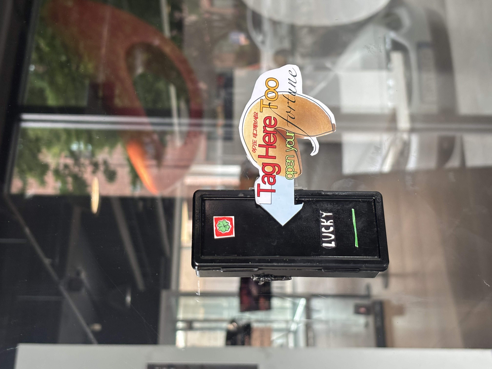
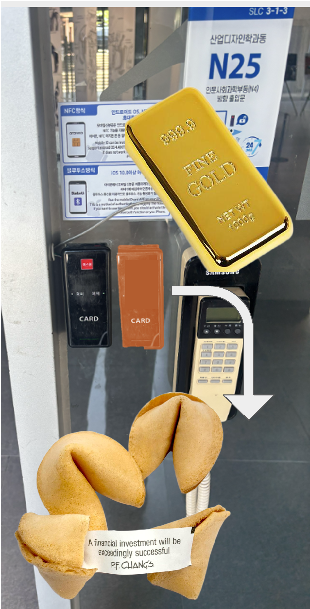
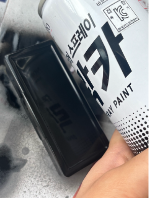
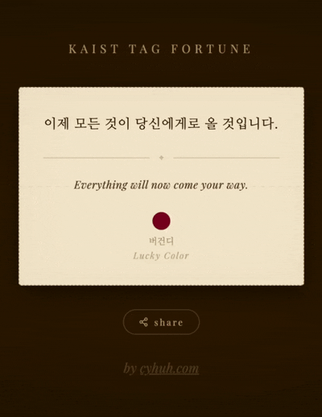
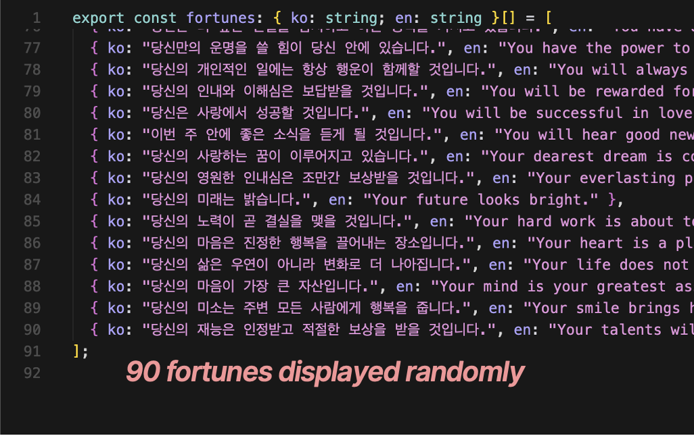
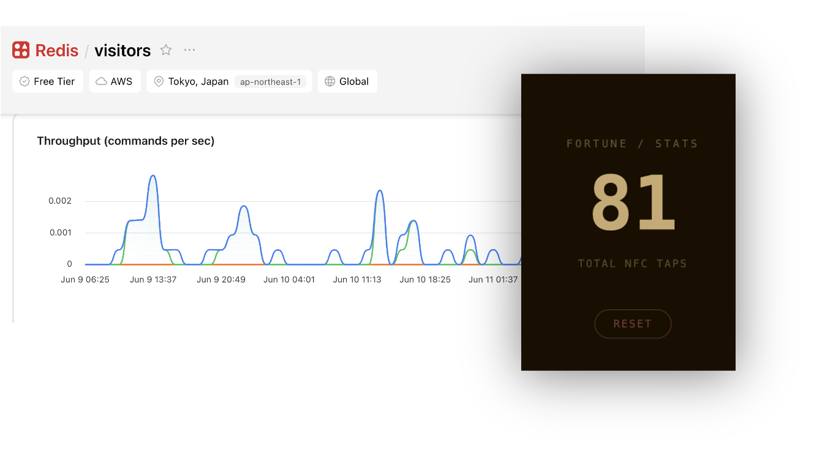
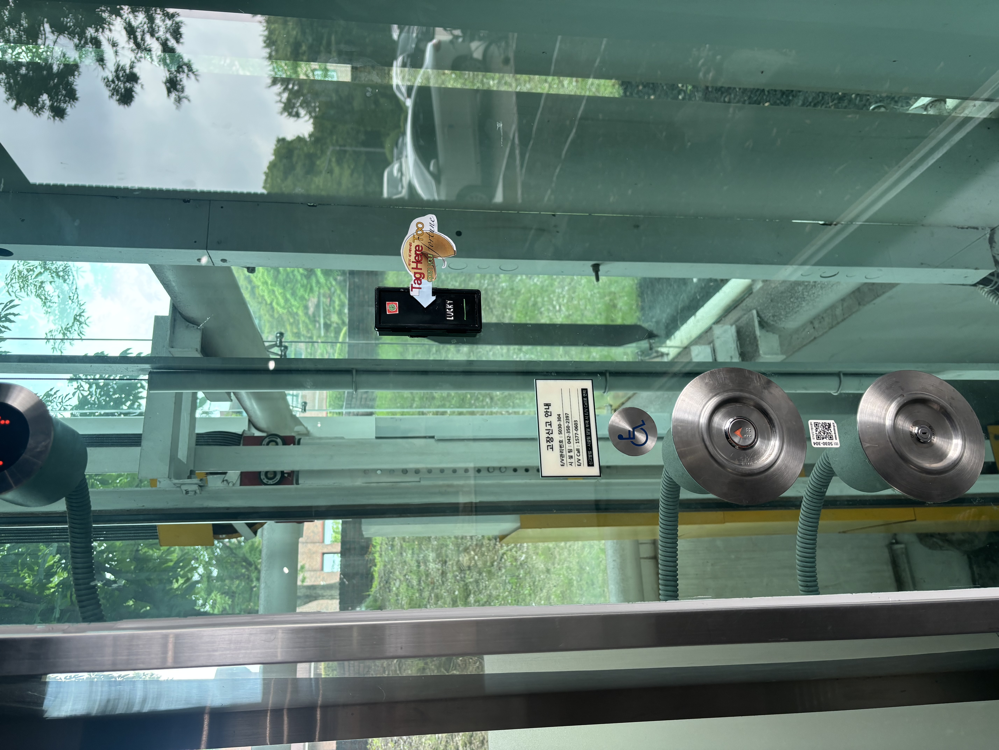

# KAIST *Tag Fortune*

> ID20012(A) · Design Studio 1 · Industrial Design, KAIST · 2026

**What if a card reader told your fortune?**

→ **[View project page (best on PC)](https://chaeyounghuh.github.io/fortune/)**
→ **[Try the fortune site](https://fortune-lemon.vercel.app/)**

---

---

## Concept

Every day, students tap their phone to enter the ID building — hands up, eyes on the reader, for just a moment not looking at a screen.

That brief pause became the interaction point. I built a **fake NFC card reader** — same shape, same placement, different outcome. Tap your phone, and instead of a door beep you get a fortune cookie slip: one line of fortune, a lucky color, just for today.

The goal was zero friction. The tap was already happening. I just gave it somewhere new to land.

---

## Prototype

<table>
<tr>
<td></td>
<td></td>
</tr>
<tr>
<td align="center">Final prototype</td>
<td align="center">Painting with black lacquer</td>
</tr>
</table>

Started with a gold bar concept → tested yellow → switched to **black lacquer** to match the real scanner aesthetic. The text "CARD" was replaced with "LUCKY," and the red label reworked into a four-leaf clover.

---

## The Fortune Site

<table>
<tr>
<td></td>
<td></td>
<td></td>
</tr>
<tr>
<td align="center">Fortune cookie slip UI</td>
<td align="center">Fortune list</td>
<td align="center">Visit tracking via Redis</td>
</tr>
</table>

Each NFC tag holds a **unique token** — same tap always shows the same fortune, new tap reveals a new one. Refreshing doesn't change it. Visit counts are tracked via Upstash Redis to measure reach.

---

## Installation

<table>
<tr>
<td></td>
<td></td>
</tr>
<tr>
<td align="center">Phase 1 · Beside the entrance (6/4–6/8)</td>
<td align="center">Phase 2 · Elevator button panel (6/8–6/11)</td>
</tr>
</table>

| | Phase 1 | Phase 2 |
|---|---|---|
| **Location** | ID building entrance | Elevator button panel |
| **Period** | Jun 4 – Jun 8 | Jun 8 – Jun 11 |
| **Taps** | 35 | 25 |

**60 taps total over 8 days.** More than expected — the barrier was already near zero since the motion (phone to reader) was part of the existing routine.

---

## Built with

- [Next.js](https://nextjs.org) + TypeScript
- [Upstash Redis](https://upstash.com) — visit tracking via NX flag
- Deployed on [Vercel](https://vercel.com)

---

by <a href="https://cyhuh.com">cyhuh.com</a>
